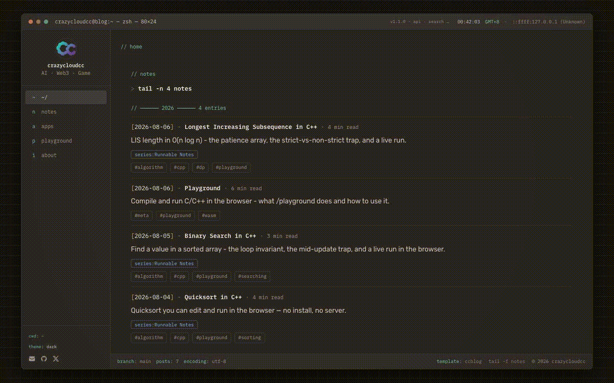
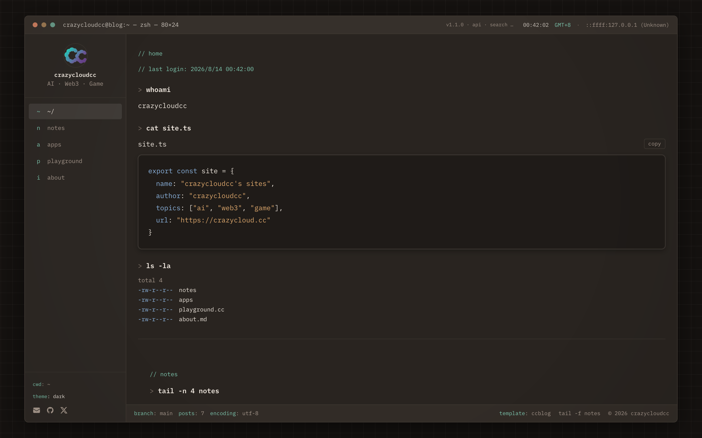
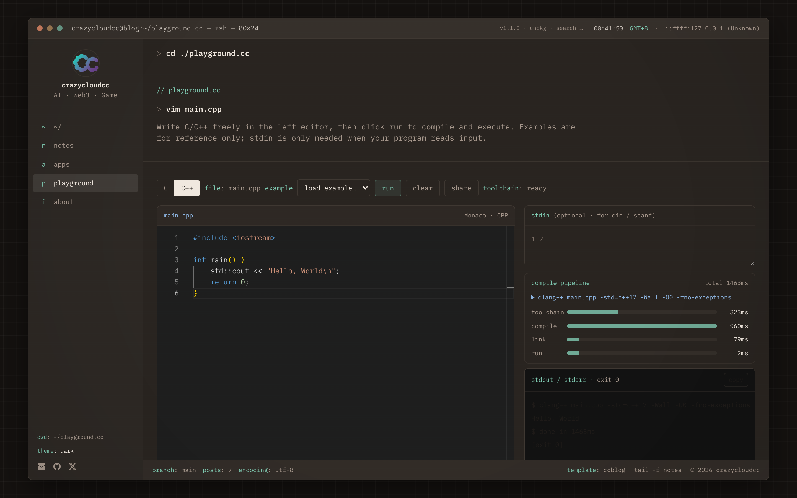
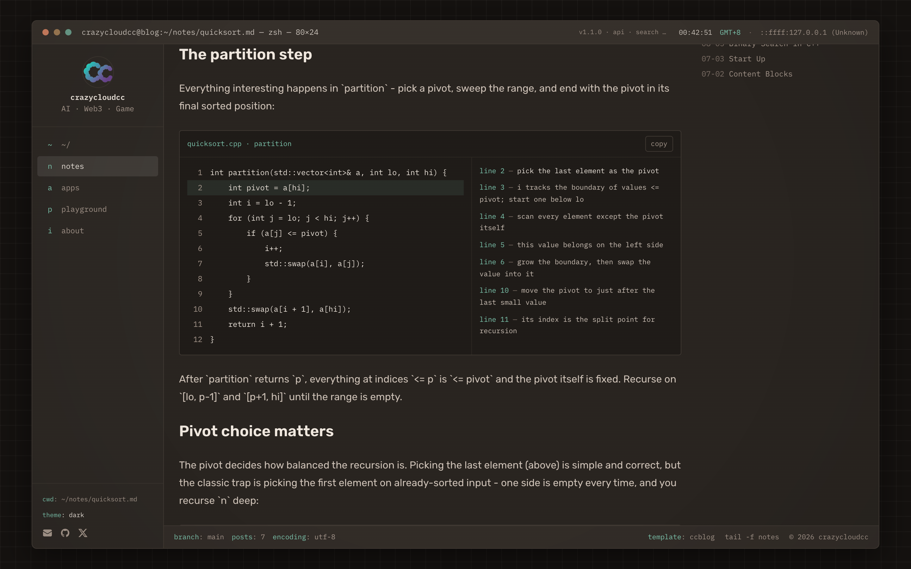

# ccblog


可 fork 的终端博客。C / C++ 在浏览器里编译运行。改一个配置文件，然后部署。

[Use this template](https://github.com/crazycloudcc/ccblog/generate)
&nbsp;·&nbsp;
[](https://vercel.com/new/clone?repository-url=https%3A%2F%2Fgithub.com%2Fcrazycloudcc%2Fccblog&env=NEXT_PUBLIC_SITE_URL&envDescription=Canonical%20public%20URL%20(e.g.%20https%3A%2F%2Fyour-domain.com)&project-name=ccblog&repository-name=ccblog)
&nbsp;·&nbsp;
[在线演示](https://crazycloud.cc)
&nbsp;·&nbsp;
[在文章里跑一遍快排](https://crazycloud.cc/blog/quicksort)
&nbsp;·&nbsp;
[English](README.md)



<p align="center">
  
  
  
</p>

### 为什么 fork 这个

- 改 `ccblog.config.ts` 就能换品牌：名字、社交链接、功能开关
- 浏览器内 **C11 / C++17**（clang → WASM，无服务端、不用安装）
- 文章可嵌入可运行代码（`:::playground`），以及 annotate / steps / bench
- 静态搜索（Pagefind）、RSS、sitemap、JSON-LD、Open Graph
- 没有 iOS 应用就保持 `features.apps` 关闭（example 配置的默认值）

第一次 Deploy 看起来仍是 demo 站。把 `ccblog.config.example.ts` 拷成 `ccblog.config.ts`，设置 `NEXT_PUBLIC_SITE_URL`，再部署一次。

---

## 项目简介

**ccblog** 是一个模仿 macOS 终端会话的 Next.js 站点。文章以 Markdown 文件存放；界面用 `cd`、`cat`、`grep` 和面板样式组织内容，而非传统博客布局。

首页有一段简短的启动动效（笔记逐行打出后落位）。主题支持浅色 / 深色 / 跟随系统，并尊重 `prefers-reduced-motion`。

### 功能概览

| 模块 | 说明 |
|------|------|
| **博客** | Markdown + frontmatter，标签与系列筛选，阅读时长，上一篇/下一篇，相关文章 |
| **搜索** | [Pagefind](https://pagefind.app/) 静态索引，`postbuild` 时生成 |
| **Playground** | 基于 [browsercc](https://www.npmjs.com/package/browsercc) WASM 的 C11 / C++17 编译运行——Monaco 编辑器、stdin、分享链接、编译阶段可视化 |
| **内容块** | 文章内支持 `:::trace`、`:::bench`、`:::annotate`、`:::playground` 等指令 |
| **元数据** | RSS、sitemap、JSON-LD、Open Graph 图片 |
| **Apps** | 可选的 App Store 目录；除非打开 `features.apps`，否则不出现 |

---

## 技术栈

- [Next.js 16](https://nextjs.org)（App Router）· React 19 · TypeScript
- [Tailwind CSS v4](https://tailwindcss.com)
- [gray-matter](https://github.com/jonschlinkert/gray-matter) 解析文章 frontmatter
- [Monaco Editor](https://microsoft.github.io/monaco-editor/) + browsercc 驱动 `/playground`
- [Pagefind](https://pagefind.app) 客户端全文搜索
- [@vercel/analytics](https://vercel.com/analytics) 隐私友好的访问统计（Vercel 上自动启用；在 `app/layout.tsx` 删除 `<Analytics />` 即可关闭）

---

## Fork 与部署

**环境要求：** Node.js 20+，npm 9+。

```bash
# 1. 用 Use this template（或 Fork），然后克隆你的副本
git clone https://github.com/<your-username>/ccblog.git
cd ccblog
npm install

# 2. 先改成你的，再做第一次认真部署
cp ccblog.config.example.ts ccblog.config.ts
#    改 name、author、social、url
#    没有 Apple 开发者 ID 就保持 features.apps 为 false

# 3. 本地运行
npm run dev    # http://localhost:3000

# 4. 部署到 Vercel
#    点上面的 Deploy 按钮，或在 https://vercel.com/new 导入仓库
#    设置 NEXT_PUBLIC_SITE_URL 为你的生产地址
```

第一次部署如果跳过第 2 步，会踩这些坑：

- 仓库里的 `ccblog.config.ts` 是 **demo 身份**。不拷 example，站点仍是 crazycloudcc，还可能同步 demo 的 App Store 列表。
- `/blog` 搜索依赖 `npm run build`（Pagefind 在 `postbuild` 生成）。只跑 `next dev` 没有索引。
- 生产环境的 Playground WASM 从 unpkg 拉取，不打进部署包。

以上就是全部流程。完整走查见站内文章 **Start Up**（`content/notes/nextjs-blog-setup.md`）。维护者干跑清单：`docs/fork-dry-run.md`。

---

## 配置

根目录的 `ccblog.config.ts` 是唯一的品牌替换入口——身份信息、社交链接、功能开关和 App Store ID 全都在这里。`npm run dev` 无需任何环境变量即可运行；生产环境只需设置规范 URL：

```bash
# .env.local（不提交到 git）
NEXT_PUBLIC_SITE_URL=https://your-domain.com
```

| 变量 | 场景 | 用途 |
|------|------|------|
| `NEXT_PUBLIC_SITE_URL` | 生产环境 | RSS、sitemap、Open Graph 的规范 URL |
| `NEXT_PUBLIC_CCBLOG_BRANCH` | 可选 | 终端状态栏显示的 Git 分支 |
| `APPLE_DEVELOPER_ID` | 可选 | 覆盖 `apps.developerId`，用于 `/apps` 同步 |
| `NEXT_PUBLIC_TOOLCHAIN_BASE` | 可选 | 生产环境 Playground WASM CDN 覆盖地址 |

`ccblog.config.ts` 中的功能开关（`features.blog`、`features.apps`、`features.playground`、`features.about`）可整条路由开关——导航、sitemap 与 apps 同步都遵循它。`/apps` 默认**关闭**。

---

## 写文章

在 `content/notes/` 下新增 Markdown 文件：

```yaml
---
title: 我的文章
excerpt: 列表和 RSS 用的一句话摘要。
date: 2026-07-08
tags:
  - nextjs
series: my-series        # 可选
difficulty: intermediate # 可选
---
```

文件名即 URL（`/blog/my-post`）。正文支持标准 Markdown、代码块、图片，以及自定义块（`:::trace`、`:::bench`、`:::annotate`、`:::playground` 等）——示例见 `content/notes/content-blocks.md`。

---

## 常用脚本

```bash
npm run dev          # 本地开发（webpack）
npm run build        # 校验配置 -> 同步 apps -> 构建 -> 生成 pagefind 索引
npm run start        # 启动生产构建
npm run lint         # ESLint
npm run sync:apps    # 从 iTunes API 刷新 lib/apps.ts
```

`npm run build` 依次执行：

1. **prebuild**——`validate-config.mjs` 校验 `ccblog.config.ts`，随后 `sync-apps.mjs` 同步 App Store 元数据（`features.apps` 为 false 时跳过）
2. **build**——Next.js 静态构建
3. **postbuild**——将 Pagefind 索引写入 `public/pagefind/`

`/blog` 的搜索依赖 production build；仅 `next dev` 不会生成索引。

---

## 路由

| 路径 | 说明 |
|------|------|
| `/` | 首页——启动动效 + 近期笔记 |
| `/blog` | 笔记列表、标签/系列筛选、搜索 |
| `/blog/[slug]` | 文章详情 |
| `/playground` | 浏览器内 C/C++ 编辑与运行 |
| `/apps` | App Store 应用（可选，默认关闭） |
| `/about` | 关于与联系方式 |
| `/feed.xml` | RSS |

---

## Playground 工具链

| 环境 | 来源 |
|------|------|
| **开发** | `/api/toolchain`——本地代理（GitHub release，回退到 `node_modules/browsercc`） |
| **生产** | [unpkg](https://unpkg.com) CDN（`browsercc@0.1.1`），可通过 `NEXT_PUBLIC_TOOLCHAIN_BASE` 覆盖 |

工具链不打进部署包（避免 Vercel Hobby 体积超限）。浏览器首次加载后会缓存。

---

## 目录结构

```
app/              # Next.js 路由与 API
components/       # UI（终端外壳、博客、Playground 等）
content/notes/    # Markdown 文章
lib/              # 站点配置适配层、解析器、Playground 核心
ccblog.config.ts  # 唯一的品牌替换入口
scripts/          # 构建辅助脚本（配置校验、apps 同步）
public/           # 静态资源（pagefind 索引在构建时生成）
```

---

## 贡献

欢迎提交 Bug 修复、新的内容块指令、社交图标和文档——见 [CONTRIBUTING.md](CONTRIBUTING.md)。铁律：不要把任何身份信息硬编码进组件，一律通过 `lib/site.ts` 走 `ccblog.config.ts`。

## 作者

由 [crazycloudcc](https://github.com/crazycloudcc) 构建与维护。欢迎 fork 与交流——联系方式见在线站点的 `/about`。

---

## 许可证

[MIT](LICENSE) © 2026 crazycloudcc
