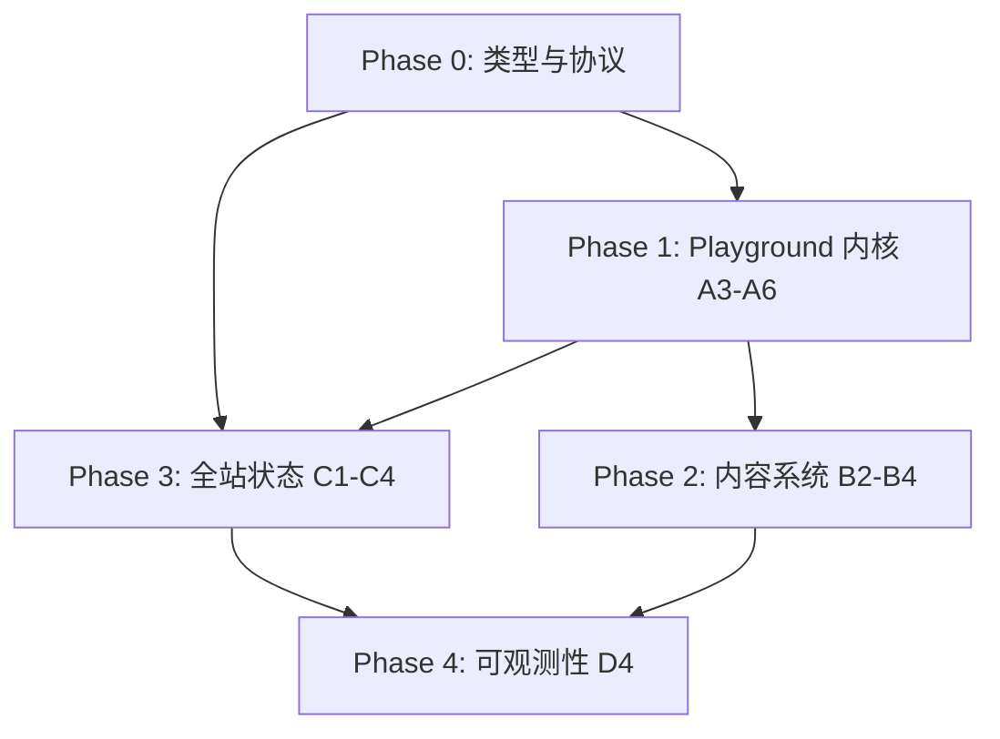

# 下一步迭代 — 可执行开发任务清单

> 范围：方案 A（3–6）、B（2–4）、C（1–4）、D（4）  
> 建议版本线：`v1.1.0` → `v1.2.0`  
> 原则：先打通 Playground 内核与类型，再叠内容块与全站可观测性。

---

## 总览与依赖



| Phase | 主题 | 预估 | 可独立发布 |
|-------|------|------|------------|
| 0 | 共享类型与 frontmatter 协议 | 0.5d | 否 |
| 1 | Playground 编译/运行/分享 | 5–7d | v1.1.0 |
| 2 | 文章可交互块 | 4–5d | v1.1.x |
| 3 | 标题栏 / 失败页 / 调试面板 | 3–4d | v1.2.0 |
| 4 | 遥测与 Web Vitals | 2–3d | v1.2.x |

---

## Phase 0 — 基础设施（阻塞项，先做）

### T0.1 扩展 Playground 运行结果类型

**目标**：为 A3/A5/A6 提供统一数据结构。

**文件**：
- `lib/playground/types.ts`
- `lib/playground/playground.worker.ts`
- `lib/playground/compile-run.ts`

**任务**：
- [ ] 定义 `CompilePhase`: `idle | fetching_toolchain | compiling | linking | running | done`
- [ ] 定义 `CompileTiming`: `{ toolchainMs?, compileMs?, linkMs?, runMs?, totalMs? }`
- [ ] 定义 `SandboxMetrics`: `{ exitCode?, timedOut?, peakMemoryBytes? }`（内存可先占位，后续 WASM 侧补）
- [ ] Worker `postMessage` 增加阶段性事件：`phase`, `compiled`, `result`
- [ ] `RunResult` 合并 timing + metrics

**验收**：
- `handleRun` 能收到至少 compile / run / total 三段耗时
- 类型在 `PlaygroundPage` / `OutputPanel` 无 `any`

---

### T0.2 Frontmatter 协议（B4 前置）

**目标**：文章元数据扩展，供 B2/B3/B4 消费。

**文件**：
- `lib/posts.ts`（`Post` / `PostFrontmatter`）
- `content/notes/*.md`（逐步迁移，非阻塞）

**任务**：
- [ ] 扩展 frontmatter 字段（均可选）：
  ```yaml
  series: playground-internals
  difficulty: intermediate   # beginner | intermediate | advanced
  runtime: browsercc         # 自由文本或枚举
  prerequisites:
    - basic C++
  playground:
    slug: hello-cpp           # 关联 share 或内置 snippet id
    readonly: true
  ```
- [ ] `getPosts()` / `getPostBySlug()` 解析并暴露新字段
- [ ] 列表页 / RSS / JSON-LD 按需暴露 `series`（其余仅详情页）

**验收**：
- 一篇示例文章带上全部新字段可正常 build
- 缺省字段不破坏现有 3 篇文章

---

## Phase 1 — 方案 A：Playground 深化

### T1.1 【A3】编译过程可视化

**文件**：
- `lib/playground/compile-run.ts`（阶段计时埋点）
- `lib/playground/playground.worker.ts`
- `components/playground/OutputPanel.tsx`
- `components/playground/PlaygroundPage.tsx`
- 新建 `components/playground/CompileTimeline.tsx`

**任务**：
- [ ] 在 `compileSource` 内分阶段计时：toolchain fetch（若未 preload）、compile、link
- [ ] `getCompilerInvocation` 结果中提取并展示实际 driver 命令摘要（可折叠）
- [ ] 展示 `getLanguageConfig()` 的 flags（`-std=c++17 -Wall -O0`）
- [ ] UI：`CompileTimeline` 显示阶段条 + 各阶段 ms
- [ ] compile 日志区保留原始 clang 输出，顶部加「阶段摘要」行

**验收**：
- 运行 hello.cpp 可见 compile / link / run / total 耗时
- 编译失败时仍显示已完成阶段的耗时

---

### T1.2 【A4】错误定位增强

**文件**：
- `lib/playground/diagnostics.ts`（主逻辑）
- 新建 `lib/playground/error-catalog.ts`（常见错误 hint）
- `components/playground/OutputPanel.tsx`
- `components/playground/CodeEditor.tsx`

**任务**：
- [ ] `parseCompileError` 返回结构：
  ```ts
  { file, line, column?, message, raw, hints?: string[] }
  ```
- [ ] 支持多错误（clang 多条 diagnostic）
- [ ] 错误列表 UI：点击跳转 `revealLine(line, column?)`
- [ ] 内置 hint 映射（至少 8 条）：`undefined reference`, `expected ';'`, `no member named`, `iostream file not found` 等
- [ ] 运行时错误与 timeout 区分展示（见 T1.3）

**验收**：
- 故意写语法错误，面板显示结构化错误 + 至少一条 hint
- 点击错误项，编辑器滚动到对应行

---

### T1.3 【A5】运行时沙箱可观测

**文件**：
- `lib/playground/compile-run.ts`（`runModule`）
- `lib/playground/playground.worker.ts`
- `components/playground/OutputPanel.tsx`
- 新建 `components/playground/RuntimeStats.tsx`

**任务**：
- [ ] 统一 status：`success | compile_error | runtime_error | timeout | oom`（oom 可先映射到 runtime_error + 文案）
- [ ] 展示：exit code（WASI 退出码）、stdout/stderr 分区、durationMs
- [ ] timeout 时 stderr 固定模板 + 建议（检查死循环 / 阻塞输入）
- [ ] stdin 为空但程序阻塞读取时，提示「可能需要 stdin」
- [ ] （可选）`performance.memory` 仅 dev 或支持时显示峰值

**验收**：
- 死循环触发 5s timeout，状态为 `timeout`，文案明确
- `scanf` 无 stdin 时有友好提示
- 成功运行显示 exit 0 与耗时

---

### T1.4 【A6】分享链接升级

**文件**：
- `lib/playground/share.ts`
- `components/playground/PlaygroundPage.tsx`
- 新建 `app/playground/embed/page.tsx` 或 `?embed=1` 模式
- `lib/playground/types.ts`

**任务**：
- [ ] `PlaygroundSharePayload` 扩展：
  ```ts
  { lang, source, stdin?, readonly?: boolean, title?: string, id?: string }
  ```
- [ ] URL 参数向后兼容（旧 `z=` 链接仍可打开）
- [ ] `readonly=1`：隐藏 Run / Clear，仅展示代码 + 输出（或仅代码）
- [ ] Permalink：稳定路径 `/playground?s=...` 或 `/playground/p/[id]`（二选一，推荐 query 先落地）
- [ ] Share 按钮复制链接时附带 `title`（取自用户输入或默认 `snippet`）
- [ ] 为 B 嵌入预留：`buildEmbedUrl(payload)`

**验收**：
- 分享链接在只读模式下无法编辑、无法运行（或按产品定义可运行只读）
- 旧链接仍可用

---

## Phase 2 — 方案 B：可执行技术内容

> 依赖：T0.2、T1.4（嵌入与 share）

### T2.1 【B4】Frontmatter  surfaced 到 UI

**文件**：
- `app/blog/[slug]/page.tsx`
- `components/blog/PostMeta.tsx`（新建）
- `components/blog/TerminalFeed.tsx`（可选 series 标签）

**任务**：
- [ ] 详情页 meta 区展示：series、difficulty、runtime、prerequisites
- [ ] `series` 链接到 `/blog?series=` 或 `/blog/series/[name]`（先做 query filter）
- [ ] `getPostsBySeries(series)` in `lib/posts.ts`

**验收**：
- 带 series 的文章在页头与列表可点击进入同系列文章

---

### T2.2 【B2】可交互技术注释块

**文件**：
- `lib/parse-post-content.ts`
- `components/blog/blocks/AnnotatedCodeBlock.tsx`（新建）
- `components/blog/PostContent.tsx`

**任务**：
- [ ] 扩展 MD 语法（示例）：
  ````markdown
  :::annotate{title="Event loop"}
  ```cpp
  // step 1: init
  ```
  - line 1: 初始化运行时
  - line 3: 进入主循环
  :::
  ````
- [ ] 或 JSON frontmatter 块：`:::steps` / `:::cases`（错误案例切换）
- [ ] 支持「步骤展开」：Step 1/2/3 切换高亮行
- [ ] 支持「错误案例」tab：good vs bad 两份代码切换
- [ ] 样式与终端主题一致（`font-mono`, `text-code-teal`）

**验收**：
- 一篇示范文章使用 annotate + cases，build 通过，交互可用

---

### T2.3 【B3】Benchmark / Trace Block

**文件**：
- `lib/parse-post-content.ts`
- `components/blog/blocks/TraceBlock.tsx`（新建）
- `components/blog/blocks/BenchmarkBlock.tsx`（新建）

**任务**：
- [ ] 语法示例：
  ````markdown
  :::trace
  compile: 120ms
  link: 80ms
  run: 15ms
  stdout: |
    Hello
  :::
  ````
  ````markdown
  :::bench
  | variant | time |
  |---------|------|
  | O0      | 15ms |
  | O2      | 12ms |
  :::
  ````
- [ ] Trace 块：左侧阶段名 + 右侧耗时条
- [ ] Bench 块：表格或横向条形对比
- [ ] （增强）与 Playground 输出 JSON 格式对齐，便于从 playground 复制粘贴进文章

**验收**：
- Start Up 或 playground 文章中插入 1 个 trace + 1 个 bench 块正常渲染

---

### T2.4 【B2+B3+A6】文章内 Playground 嵌入

**文件**：
- `lib/parse-post-content.ts`
- `components/blog/blocks/PlaygroundEmbed.tsx`（新建）
- `frontmatter.playground` 联动

**任务**：
- [ ] 语法：`:::playground{lang=cpp readonly}` + 代码块
- [ ] 或 frontmatter `playground: { slug, readonly }` 自动在文末嵌入
- [ ] iframe / 内联组件：加载 share payload 或内联 source
- [ ] 高度自适应，移动端可用

**验收**：
- 文章中嵌入 hello.cpp，读者可运行或只读查看（按 readonly）

---

## Phase 3 — 方案 C：全站工程化体验

### T3.1 【C1】动态标题栏状态

**文件**：
- `components/terminal/TerminalTitleBar.tsx`
- `lib/site-status.ts`（新建，聚合状态）
- `components/playground/PlaygroundPage.tsx`（上报 toolchain ready）
- `components/blog/NotesSearch.tsx`（上报 search index ready）

**任务**：
- [ ] 轻量 context / module store：`SiteStatus`
  - `buildVersion`（`package.json` version 注入 `NEXT_PUBLIC_APP_VERSION`）
  - `toolchainSource`（unpkg / api / custom）
  - `toolchainReady`
  - `pagefindReady`
- [ ] 标题栏右侧次要信息（hover tooltip 或窄屏折叠）：
  - `v1.0.0 · unpkg · search ✓`
- [ ] 不挤占时钟/geo 区域

**验收**：
- 生产构建显示版本号与 toolchain 来源
- `/blog` 搜索可用后 search 状态为 ready

---

### T3.2 【C2】路由级 observability（客户端）

**文件**：
- 新建 `lib/observability/client-metrics.ts`
- `components/terminal/TerminalShell.tsx`（路由切换 hook）
- `components/playground/PlaygroundPage.tsx`
- `components/blog/NotesSearch.tsx`

**任务**：
- [ ] 记录指标（内存 store，dev 可打印）：
  - `routeTransitionMs`
  - `toolchainWarmupMs`
  - `searchLatencyMs`
  - `ttfi`（首次可交互：toolchain ready 或 LCP 近似）
- [ ] `useReportWebVitals` 接入 Next（LCP / INP / CLS）→ 与 D4 汇合
- [ ] dev 下 `console.debug('[metrics]', snapshot)` 

**验收**：
- 切换路由后可在 dev console 看到计时
- Playground 冷启动记录 warmup 耗时

---

### T3.3 【C3】失败场景可视化

**文件**：
- `components/playground/PlaygroundPage.tsx`
- `components/blog/NotesSearch.tsx`
- 新建 `components/terminal/DegradedStatePanel.tsx`
- `app/not-found.tsx`（参考样式）

**任务**：
- [ ] Playground toolchain 失败：专用面板
  - 失败 URL、HTTP 状态、重试按钮、切换镜像说明
- [ ] Blog 搜索 index 缺失：`Search index not built` + `npm run build` 提示
- [ ] API `/api/toolchain` 503：说明生产应走 unpkg
- [ ] 统一 `DegradedStatePanel`：`title`, `command`, `hint`, `action?`

**验收**：
- 删除 `public/pagefind` 且未 build 时，搜索显示明确降级 UI
- 阻断 unpkg（devtools offline）时 playground 显示可理解错误

---

### T3.4 【C4】开发调试面板

**文件**：
- 新建 `components/dev/DebugPanel.tsx`
- `components/terminal/TerminalShell.tsx`
- 仅 `process.env.NODE_ENV === 'development'` 渲染

**任务**：
- [ ] 快捷键 `` ` `` 或 `Ctrl+Shift+D` 开关面板
- [ ] 展示：theme preference / resolved、`pathname`、cwd、toolchain base、pagefind loaded、最近 metrics（C2）
- [ ] 「复制 debug snapshot」JSON 到剪贴板
- [ ] 生产构建 tree-shake 掉（动态 import 或 `NODE_ENV` 守卫）

**验收**：
- `npm run dev` 可打开面板；`npm run build && start` 无面板

---

## Phase 4 — 方案 D：可观测性（D4）

### T4.1 客户端事件模型

**文件**：
- 新建 `lib/observability/events.ts`
- 新建 `lib/observability/report.ts`

**任务**：
- [ ] 定义事件：
  - `page_error`
  - `toolchain_fetch_failed`（file, url, status）
  - `search_failed` / `search_success`（latencyMs）
  - `playground_run`（status, timing）
  - `web_vital`（name, value）
- [ ] 统一 `report(event)`：dev → console；prod → 可插拔 sink

**验收**：
- 所有 report 调用经单一入口，无散落 `console.error`

---

### T4.2 上报通道（可渐进）

**文件**：
- `app/layout.tsx`（Web Vitals）
- `lib/observability/report.ts`

**任务**：
- [ ] Phase 4.2a：仅 `navigator.sendBeacon` → `/api/telemetry`（可选，默认可关闭）
- [ ] Phase 4.2b：或接入 Vercel Analytics / 自建 Axiom / Datadog（环境变量开关）
- [ ] `NEXT_PUBLIC_TELEMETRY_ENABLED=false` 默认关闭，隐私友好
- [ ] 不采集 IP / 正文内容，仅聚合指标

**验收**：
- 默认部署无上报请求
- 开启 env 后 toolchain 失败可计数

---

### T4.3 仪表盘 / 自查（最小）

**任务**：
- [ ] `docs/observability.md`：事件列表、如何开启 telemetry
- [ ] （可选）`/api/health` 返回 `{ version, pagefind: bool }` 供外部 probe

**验收**：
- 维护者能根据文档在本地验证事件触发

---

## 建议排期（单人）

| 周 | 任务 | 交付 |
|----|------|------|
| W1 | T0.1, T0.2, T1.1, T1.2 | Playground 可视化 + 错误解析 |
| W2 | T1.3, T1.4 | 运行时指标 + 分享升级 |
| W3 | T2.1–T2.3 | Frontmatter UI + annotate/trace/bench |
| W4 | T2.4, T3.1–T3.2 | 文章嵌入 + 标题栏/metrics |
| W5 | T3.3–T3.4, T4.1–T4.2 | 降级 UI + 调试面板 + 遥测 |

---

## 发布切分建议

| Tag | 包含 |
|-----|------|
| **v1.1.0** | T0.1, T1.1–T1.4, T3.3（playground 部分） |
| **v1.1.1** | T2.1–T2.4 + 1 篇示范文章 |
| **v1.2.0** | T3.1–T3.4, T4.1–T4.3 |
| **v1.2.x** | 遥测 sink 接第三方（若需要） |

---

## 示范文章（与开发并行）

建议新增 2 篇，开发时 dogfood：

1. **Inside playground.cc** — 用 T2.2 annotate + T2.3 trace + T2.4 embed
2. **Observability on a static-first blog** — 用 T3/C4/D4 的自指说明

---

## 风险与约束

| 风险 | 缓解 |
|------|------|
| WASM 内存指标难拿 | A5 先展示 time/exit/timeout，memory 标「experimental」 |
| 分享 URL 过长 | 超 `MAX_SHARE_URL_LENGTH` 时提示改用 gist 或短 id 服务 |
| 自定义 MD 块过多 | 统一走 `parse-post-content.ts` 插件表，避免 PostContent 膨胀 |
| 遥测隐私 | 默认关闭；无 PII；文档说明 |

---

## 下一步行动（本周可开工）

1. 开分支 `feat/playground-observability`
2. 完成 **T0.1** + **T1.1**（编译阶段计时 UI）
3. 并行起草 **Inside playground.cc** 大纲，开发完 T1 后填入 trace/embed 块
